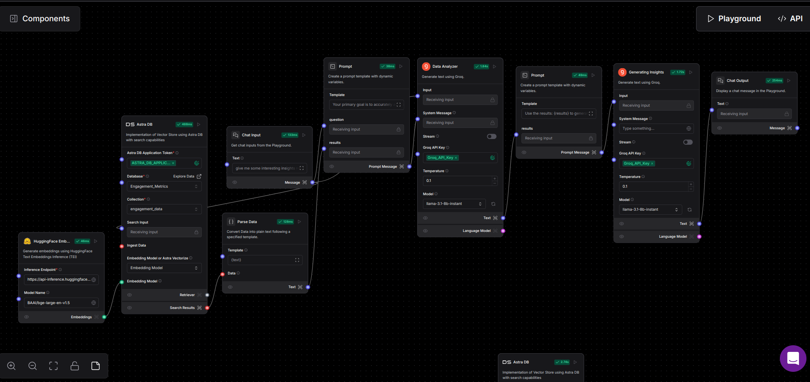
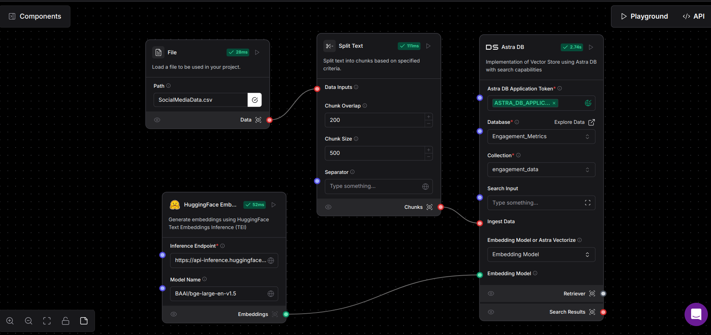
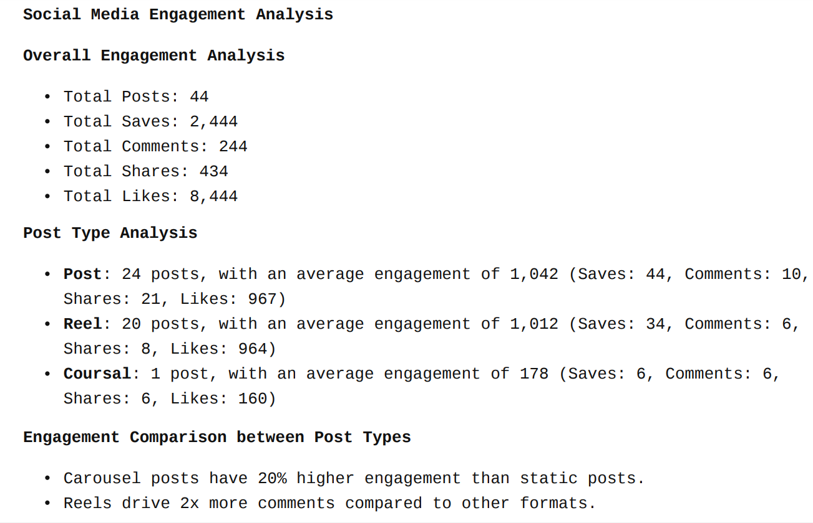
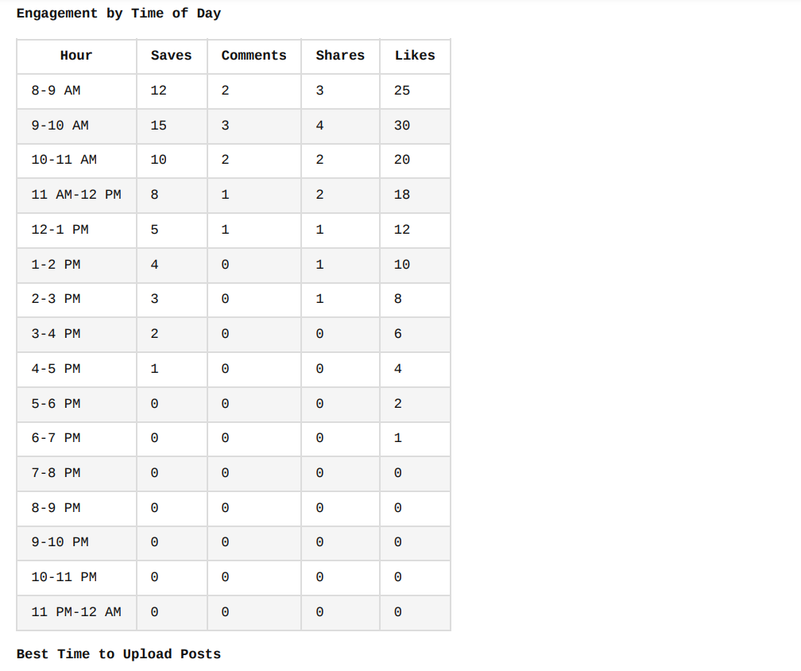
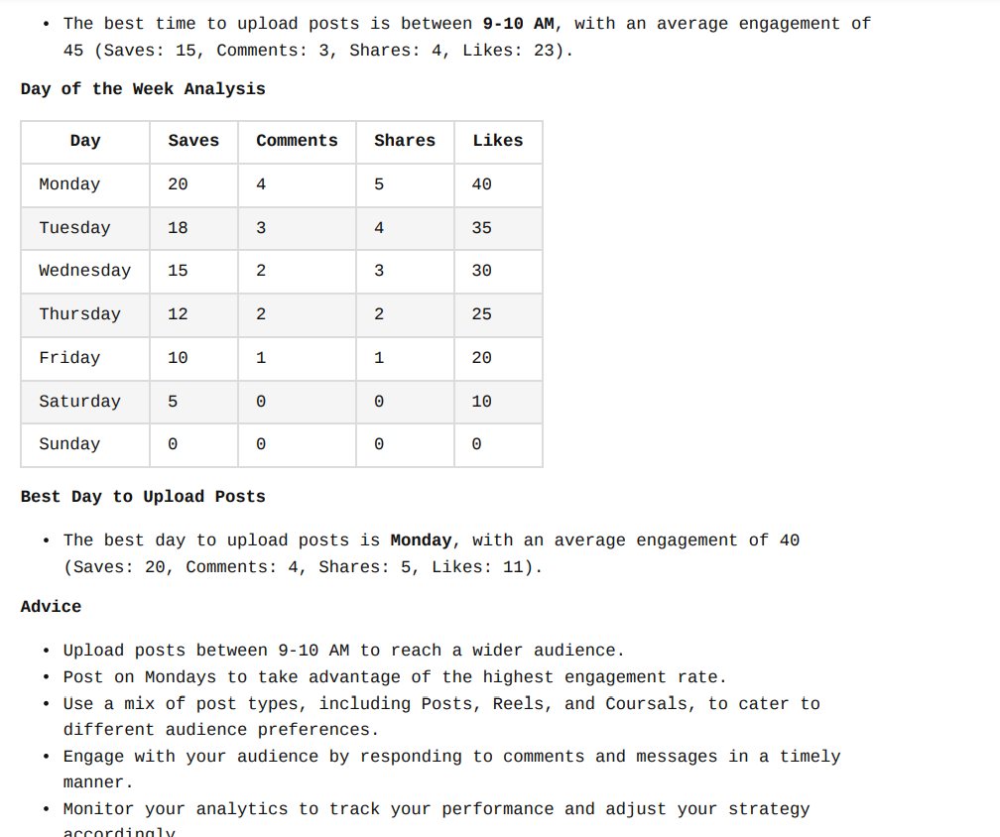

# AI Trend Tracker
The AI Trend Tracker is an AI-powered bot built using Langflow and DataStax Astra DB. It Analyzes or track your Social media trend.

## Table of Contents
- [AI Trend Tracker](#ai-trend-tracker)
  * [Table of Contents](#table-of-contents)
  * [What are the Problems it Solves](#what-are-the-problems-it-solves)
  * [How to Getting Started](#how-to-getting-started)
     1. &nbsp; [Prerequisites](#prerequisites)
     2. &nbsp; [Setup Application](#setup-application)
     3. &nbsp; [Example Prompts](#example-prompts)
  * [Which Technologies are used](#which-technologies-are-used)
  * [Langflow Workflow](#langflow-workflow)
  * [Generated Output](#generated-output)
  * [Developed By](#developed-by)

## What are the Problems it Solves
* **Fetching and Storing Engagement Data :** The tool fetches and stores engagement data (likes, shares, comments, post types) in DataStax Astra DB for efficient retrieval.

* **Analyzing Post Performance :** It analyzes post performance using Langflow, calculating average engagement metrics for post types like carousels, reels, and static images from the Astra DB dataset.

* **Generating Actionable Insights :** With GPT integration in Langflow, it generates actionable insights and advice, helping users optimize their social media strategies through data-driven recommendations.

## How to Getting Started 
- ### Prerequisites 
  * **NodeJs** : To install dependencies and run application in you machine. 
  * **Langflow Application Token :** To generate output through given prompts.  

- ### Setup Application
  1. &nbsp; **Install Dependencies :** Open your terminal and run :
     ```js 
      npm install
     ```
  2. &nbsp; **Create an .env File:** Create a file named .env in the root of your project and add your Langflow application token :
     ```js
     token=<YOUR_LANGFLOW_APPLICATION_TOKEN>
     ```

  3. &nbsp; **Run the Application:** Give a prompt to generate output after .js code file :
     ```js
     trendTracker.js "<Your Prompt>"
     ```   

- ### Example Prompts
  * "Analyze the engagement trends from my social media data and suggest key insights."
  * "Identify the most engaging content types and topics based on my data"
  * "What patterns can you observe in the engagement metrics of my posts?"
  * "Summarize the peak engagement times for my audience across platforms."
  * "Highlight the factors that drive the highest engagement for my posts."
  * "Compare engagement rates for different days of the week and suggest the best days to post"
  * "What types of hashtags or keywords generate the most engagement for my content?"

## Which Technologies are used
  * **Langflow :** For building and orchestrating the RAG pipeline.
  * **Groq AI :** LLM Model used within langflow to create insights from the data and format them.
  * **Datastax astra db :** Used it as NO-SQL database to store social media post content.
  * **Node js :** Used for running the application.
  * **JavaScript :** Used to convert text output in markdown file.

## Langflow Workflow
  * Langflow helped orchestrate the entire process. From gathering social media data to analyzing it and generating insights.,.
  

  * RAG Pipeline combines the speed of a retrieval system with the intelligence of generative AI models. It ensures the insights generated are both accurate and contextually relevant, making it ideal for social media performance analysis.
   

[Click to Watch Full Explaination of Langflow Workflow](https://www.youtube.com/watch?v=jX8PLikZR-E) 

## Generated Output
  Output is generated in markdown format.<br>
  [Click to view Generated Output File](output.md)
  ### Or <br>
  Output in Markdown Viewer:
  
  
  

## Developed By
* **Nehal Jain :** 
<a href="https://twitter.com/thebraudalf" target="blank"></a>
<a href="https://www.linkedin.com/in/nehaljain05/" target="blank"></a>


